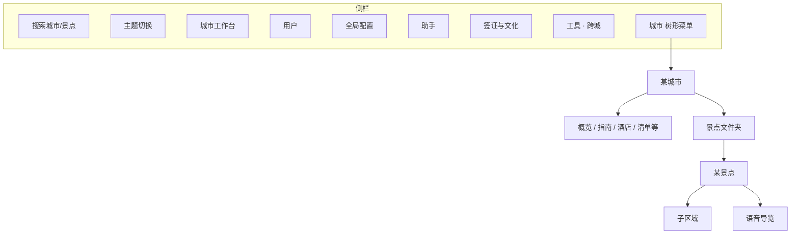
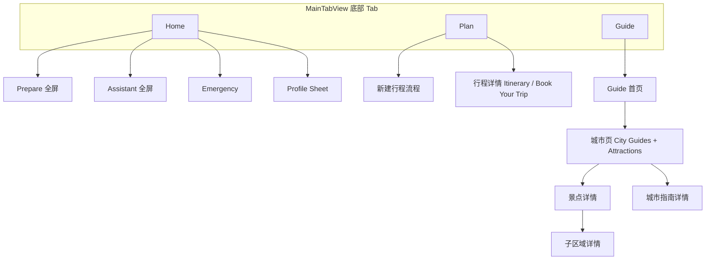
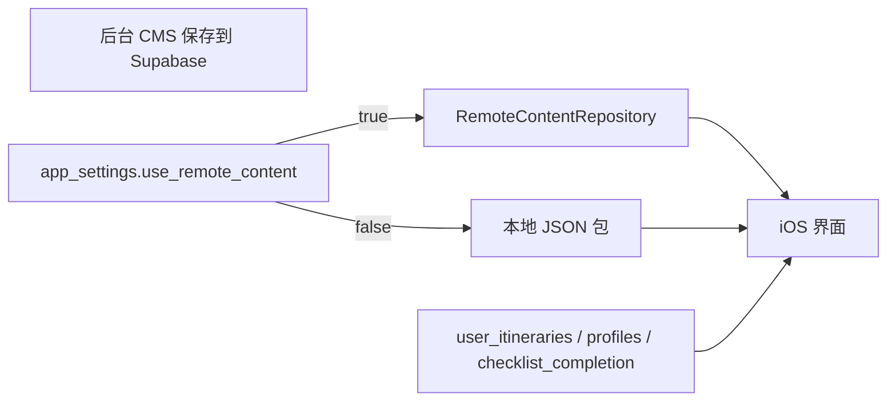

# YOLO HAPPY 后台 CMS 操作手册

本文档面向**内容运营与编辑**：说明如何在浏览器后台录入/修改内容，以及这些内容在 **iOS App** 的哪个 Tab、哪一屏、哪一块 UI 上出现。

技术安装与 Supabase 配置见 [README.md](./README.md)。

---

## 目录

1. [如何使用本后台](#1-如何使用本后台)
2. [App 结构总览](#2-app-结构总览)
3. [按 App 页面查找（用户在 App 里看到什么）](#3-按-app-页面查找)
4. [按后台侧栏查找（我在后台改什么）](#4-按后台侧栏查找)
5. [待 App 接入（后台可改，用户暂看不到）](#5-待-app-接入)
6. [附录](#6-附录)
7. [媒体上传与国内 App CDN 同步](#7-媒体上传与国内-app-cdn-同步)

---

## 1. 如何使用本后台

### 1.1 启动与登录

**本地开发：**

```bash
cd admin && python3 -m http.server 8081
```

浏览器打开 **http://localhost:8081**（不要用 `file://` 打开，否则无法上传图片/音频）。

**Cloudflare 线上（团队共用）：** 见 [README.md — 部署到 Cloudflare](./README.md#6-部署到-cloudflare)。当前项目地址示例：**https://yoloadmin.cstudiomunger.workers.dev**（须部署 `admin/` 目录；若打开是分享站说明页，见 README「打开却是分享站首页」）。

使用 Supabase **管理员账号**登录（账号须在 `admin_users` 表中）。

### 1.2 侧栏结构



| 操作 | 说明 |
|------|------|
| **三角图标** | 向右 = 折叠；向下（倒三角）= 展开 |
| **搜索框** | 按城市名、景点名过滤树；匹配项所在分组会自动展开 |
| **◐ 主题** | 跟随系统 → 浅色 → 深色，刷新后仍记住 |
| **推荐流程** | 侧栏 **城市工作台** 或 **城市** 树 → 点城市名 → 改「城市概览」或子项；点 **景点** → 主区进入解说编辑 |

### 1.3 主内容区与保存

- 点击侧栏节点后，**右侧主区**显示对应表单或列表。
- 表单底部或列表行内 **保存**；成功会出现底部 Toast「已保存」。
- 上传封面/音频后需 **保存** 对应记录，App 才会拉到新 URL。
- 修改内容后，App 端可在 Profile → **Refresh from CMS** 拉最新远程配置（内容表由 `use_remote_content` 控制）。

### 1.4 正文格式（Markdown）

所有景点简介、城市说明、紧急指南、法律文档等**长正文**统一使用 **Markdown** 录入（admin-vue 后台）。请勿粘贴 HTML 或 Word 富文本；保存时若检测到 `<p>`、`<table>` 等标签会被拦截。

| 语法 | 写法 |
|------|------|
| 小标题 | `##` / `###`（不用一级 `#`） |
| 加粗 | `**文字**` |
| 列表 | `- 条目` 或 `1. 条目` |
| 链接 | `[文字](https://...)` |
| 图片 | `` 或用编辑器 **插入图片** |
| 表格 | GFM 表格（紧急指南等需要） |

完整约定见仓库 [`docs/content-markdown-spec.md`](../docs/content-markdown-spec.md)。预览区应与 App 展示一致。

### 1.5 城市树节点一览

| 侧栏节点 | 主区做什么 |
|----------|------------|
| **城市工作台**（工作台分组） | 城市卡片列表，可进入各城或新建城市 |
| + 新建城市（城市树顶部） | 直接弹出新建城市表单 |
| **城市名** | 城市概览表单（英文名、封面、简介等） |
| 城市指南 | 该城 `city_guides` 列表 CRUD |
| 酒店 | 该城 `hotels` 列表 |
| 行前清单 | 该城相关 `checklist_items` + **全局清单设置** 按钮 |
| 首页提示 | 该城 `home_tips`（见 [第 5 章](#5-待-app-接入)） |
| 购物清单 | 该城 `shopping_items`（见第 5 章） |
| 阅读清单 | 含该城的 `reading_list` |
| 音频导览（城市） | 按景点分组的全市音频列表 |
| **景点 (N)** | 展开后列出景点 |
| 景点名 | **解说与详情** 整页编辑器 |
| 子区域 | 跳转到解说页并定位子区域块 |
| 语音导览 | 跳转到解说页并定位音频块 |
| + 新建景点 | 新建景点解说页 |

---

## 2. App 结构总览

App 底部仅 **3 个 Tab**：**Home**、**Plan**、**Guide**。另有全屏/弹层：**Prepare**（行前清单）、**Assistant**、**Emergency**、**Profile**（点头像）。



### 2.1 数据从哪里来



| 开关（应用配置） | 作用 |
|------------------|------|
| **远程内容** `use_remote_content` | `true`：城市/景点/清单等走 Supabase；`false`：用 App 内置 JSON |
| **远程 AI** `use_remote_ai` | `true`：助手/行程生成走 Edge Function（需配置 Secrets） |
| **远程内购** `use_remote_iap` | `true`：未购景点音频锁定与 Paywall；`false`：全员视为已解锁（演示） |

---

## 3. 按 App 页面查找

以下 App 文案以 **英文界面** 为准（与用户截图一致）；括号内为后台表名。

---

### 3.1 Home Tab

**界面线框：**

```
┌──────────────────────────────────────┐
│ Good morning, …          [头像]      │
├──────────────────────────────────────┤
│ [Hero 卡]                             │
│  · 签证行 (国旗 + Passport + 规则)    │
│  · Preparation 3/12 complete 进度条   │
│  · 行程标题 / 日期 / 城市行           │
│  · View Itinerary | Prep List →      │
├──────────────────────────────────────┤
│ Quick Access                          │
│  [Prep Checklist]  [Emergency]        │
├──────────────────────────────────────┤
│ [Ask me anything…]  → 打开 Assistant   │
└──────────────────────────────────────┘
```

| 用户在 App 看到的位置 | 后台改哪里 | 表 / 字段 |
|----------------------|------------|-----------|
| Hero 顶部 **护照/签证** 一行 | 签证与文化 → 护照国家、签证规则；用户国籍在 **用户与购买** 或 App 内改 `country_code` | `passport_countries`, `visa_rules`, `profiles.country_code` |
| Hero **Preparation X/Y complete** | 城市树 → **行前清单**（entry/universal/city 三类） | `checklist_items` |
| Quick Access **Prep Checklist** | 同上 | `checklist_items` |
| 点 Prep → 全屏 **Prepare** | 同上 + **阅读清单** | `checklist_items`, `reading_list` |
| Quick Access **Emergency** | 全局配置 → **紧急联系** | `emergency_config` |
| 底部 AI 输入 → **Assistant** | 应用配置：助手问候；助手 → 场景/芯片 | `app_settings.assistant_greeting_*`, `assistant_chips`, `assistant_scenarios` |
| 点头像 → **Profile** | 应用配置、用户与购买 | `app_settings`, `profiles` |
| Profile **Trip reminders** | 城市 → 行前清单 → **全局清单设置** | `checklist_settings` |
| Profile **About / Privacy / Terms** | 应用配置 | `about_*`, `privacy_policy_html`, `terms_of_service_html` |
| Profile **Refresh from CMS** | 应用配置远程开关 | `use_remote_content` 等 |

**无行程时 Hero 文案**（如 "Your China adventure starts here"、"Plan My First Trip"）目前多为 App 内置文案；`home_dashboard_cards` 在后台可配但 **尚未接入 UI**（见第 5 章）。

---

### 3.2 Prepare（从 Home 进入）

**界面线框：**

```
┌──────────────────────────────────────┐
│ ← Home    Prepare                     │
│ 副标题（行程名 / 进度）                │
│ [进度环]  X / Y done                   │
├──────────────────────────────────────┤
│ 分阶段清单（Before departure / …）     │
│  - 清单项标题  [Done] [Skip]           │
├──────────────────────────────────────┤
│ 📚 Read Before You Go（若有阅读项）     │
└──────────────────────────────────────┘
```

| App 位置 | 后台 |
|----------|------|
| 各阶段清单项标题、外链 | 城市树 → **行前清单**；类型 entry / universal / city 见 [附录 6.2](#62-行前清单三类规则) |
| 项详情页 Mark as Done / Skipped | 同上字段 `title_en`, `external_links` 等 |
| **Read Before You Go** 列表 | 城市树 → **阅读清单**（`city_ids` 含该城） |
| 推送提醒文案 | 行前清单 → **全局清单设置** | `checklist_settings.push_*` |

---

### 3.3 Plan Tab

**界面线框：**

```
┌──────────────────────────────────────┐
│ Plan                                  │
│ Plan your China trip … [新建]         │
├──────────────────────────────────────┤
│ Saved trips · N                       │
│  [ACTIVE] 行程标题                     │
│  meta · 路线 · N days                 │
│  X/Y prep complete                    │
└──────────────────────────────────────┘
```

| App 位置 | 后台 |
|----------|------|
| **Saved trips** 列表与 ACTIVE 行程 | **工具 → 用户行程** 或 **用户与购买** → 用户详情（数据来自用户同步，非纯 CMS） |
| 每行 **X/Y prep complete** | `checklist_items` + 用户完成态 |
| 新建行程：选城市 | 城市树 → **城市概览** / `cities` |
| AI 生成日行程 | 应用配置 AI 字段 + 景点库 `attractions`；离线回退 **工具 → 行程模板** `content_itineraries` |
| 行程详情 **Itinerary** 分段：按日景点 | `attractions` + 用户行程 JSON |
| 行程详情 **Book Your Trip** | 城市 → **酒店**；应用配置 **机票平台链接** |
| **Search foreigner-friendly hotels** | `hotels`（按 `city_id`） |
| 机票外链按钮 | `app_settings.flight_platforms` |
| **Share Itinerary** | 用户行程 `share_slug`（后台可查看/编辑用户行程） |
| **Have an invite code?** | 侧栏 **邀请码** 生成；用户详情可查看兑换记录 |
| 付费墙划线价 | **会员计划** + 应用配置 `paywall_compare_price_enabled` |
| 景点 **Paywall**（与 Guide 共用） | 应用配置 Paywall 文案 + 景点 `iap_product_id` |

---

### 3.4 Guide Tab

#### Guide 首页 `Guide` / **Explore All Cities**

```
┌──────────────────────────────────────┐
│ Guide                                 │
│ Audio attraction tours                │
│ Explore All Cities                    │
│ [城市卡片 grid]                       │
│ Your Trip / Your Trip Destinations    │
│ （有 active 行程时显示相关城市）       │
└──────────────────────────────────────┘
```

| App 位置 | 后台 |
|----------|------|
| 城市卡片名、emoji、景点数 | 城市树 → **城市概览** `cities` |
| **N attractions →** | `attractions` 数量；`cities.attraction_count` 可维护 |

#### 城市页 `GuideCityAttractionsView`

```
┌──────────────────────────────────────┐
│ [封面] 城市简介 Markdown               │
│ City Guides                           │
│  - 指南条目 → 详情页                   │
│ Attractions                           │
│  N available                          │
│  - 景点行（摘要、🎧 Audio Guide）      │
└──────────────────────────────────────┘
```

| App 位置 | 后台 |
|----------|------|
| 顶部封面与简介 | `cities.cover_image_path`, `description`（Markdown） |
| **City Guides** 列表 | 城市树 → **城市指南** `city_guides` |
| 指南详情标题、正文、meta、音频 | 单条 `city_guides`（含 `CityGuideAudioSection`） |
| **Attractions** 列表行 | 景点 **解说与详情**：`name`, `summary`, `short_description` |
| 列表 **🎧 Audio Guide available** | 景点 `audio_guide_count` / 关联 `audio_guides` |

#### 景点详情 `AttractionDetailView`

```
┌──────────────────────────────────────┐
│ ← 返回                                │
│ [封面轮播] 英文名 / 中文名 / 地址      │
│ 🎧 Audio Guide  [播放器 / Paywall]    │
│ Introduction  (Markdown 正文)         │
│ Explore by Area → 子区域列表          │
│ Practical Info  (门票/时长等条目)      │
│ Visitor Tips  (bullet 列表)           │
│ （Plan 上下文下: Add to Day N）        │
└──────────────────────────────────────┘
```

| App 区块标题 | 后台「景点 → 解说与详情」字段 |
|--------------|------------------------------|
| 封面轮播 | `cover_images`, `cover_image_path`, 上传封面 |
| 名称/地址 | `name`, `chinese_name`, `address_en`, `address_zh` |
| **Introduction** | `introduction`（Markdown，可插图） |
| **Practical Info** | `practical_info`（结构化条目列表） |
| **Visitor Tips** | `western_visitor_tips` |
| 周边（若展示） | `nearby_places` |
| **Explore by Area** | 景点下 **子区域** `sub_areas` |
| **🎧 Audio Guide** | 景点下 **语音导览** `audio_guides` |
| Paywall 弹窗文案 | 应用配置 **Paywall** 段；试听秒数 `free_audio_preview_seconds` |
| 景点级 Paywall 副标题 | `paywall_subtitle_override`, `iap_product_id` |

#### 子区域详情 `SubAreaDetailView`

从景点页 **Explore by Area** 进入；展示子区域名称、正文、音频（可能锁定）。

| 后台 |
|------|
| 景点树 → 景点 → **子区域** → 具体条目，或解说页内 **子区域 / 展区** 区块 |

字段：`name_en`, `name_zh`, `body`, 展区音频上传, `sort_order`, `is_active`。

---

### 3.5 Assistant（全屏）

```
┌──────────────────────────────────────┐
│ Assistant · Your in-China helper      │
│ [芯片 chip] [芯片] …                  │
│ 对话气泡                                │
│ 输入框                                  │
└──────────────────────────────────────┘
```

| App 位置 | 后台 |
|----------|------|
| 首条问候 | 应用配置 `assistant_greeting_general` |
| 顶部 **芯片** 文案与场景 | **助手芯片** `assistant_chips` → 关联 **助手场景** `assistant_scenarios` |
| 点击芯片后的 AI 回复 | 远程 AI：`assistant_scenarios.ai_system_prompt` + 全局 AI Prompt |
| 芯片 **emergency** | 打开 Emergency，非 AI |
| 离线静态回复 | `assistant_replies`（侧栏无入口，见第 5 章） |

---

### 3.6 Emergency

| App 位置 | 后台（🆘 紧急） |
|----------|----------------|
| 110 / 120 拨号 | **紧急联系** → `emergency_config.contacts`（仅 110、120） |
| 帮助列表（无标题） | **帮助列表** → `emergency_help_items` |
| 医疗与药品列表 | **医疗与药品** → `emergency_medical_items` |
| 推荐城市医院 | **推荐医院（按城市）** → `city_hospitals` |

列表项点击进入 Markdown 详情；`sort_order` 控制顺序，`is_active` 控制上下线。

---

### 3.7 Profile（Home 右上角头像）

| App 位置 | 后台 |
|----------|------|
| Pro / 单购展示文案 | 应用配置 **内购展示文案** |
| **Change nationality** | 签证与文化 → 护照国家 |
| 已购景点解锁 | **用户与购买** → `purchased_attraction_ids` |
| **Have an invite code?** | 侧栏 **邀请码** 生成兑换码；兑换后写入 `profiles.membership_override = grant` |
| 付费墙划线价 | **会员计划** `compare_price_label` + 应用配置 `paywall_compare_price_enabled` |
| Content Mode 标签 | `use_remote_content` / `use_remote_ai` |

---

## 4. 按后台侧栏查找

### 4.1 用户 → 用户与购买

| 操作 | App 影响 |
|------|----------|
| 列表查看邮箱、Pro、已购数、引导状态 | Profile、Plan、Home 同步展示 |
| 详情改 `is_pro`、`purchased_attraction_ids` | 音频解锁、Paywall 是否出现 |
| 改 `country_code` | Home/Profile 签证规则匹配 |
| 改 `departure_date` | Home 倒计时、Prepare 提醒 |
| **在「用户行程」表中筛选** | 对应 Plan **Saved trips**（跳转后带筛选） |
| 查看 **邀请码兑换** 记录 | 用户详情 → 邀请码兑换表（`invite_code_redemptions`） |

> 购买记录为 App **本地模拟同步** 的 `profiles` 字段，不是 App Store 账单。

### 4.1.1 邀请码（侧栏 🎟 邀请码）

| 操作 | 说明 |
|------|------|
| **新建 / 批量生成** | 设置权益时长（1 月 / 2 月 / 半年 / 终身 / 自定义天数）、关联 `membership_plans`、兑换模式（一次性 / 限量 / 不限量） |
| **批次** | 同一 `batch_id` 下每账号仅可兑一次（防刷同一活动） |
| **账号限制** | `one_per_account`：该用户终身只能成功兑换任意一个邀请码 |
| **新用户专享** | `new_users_only`：无有效会员、无历史兑换记录才可兑 |
| **停用** | 手动关闭或达到 `max_redemptions` 后自动停用（`auto_deactivate_on_exhaust`） |
| **兑换记录** | 全站列表或 **用户与购买 → 用户详情** 查看该用户的 `invite_code_redemptions` |

App 入口：Profile / 付费墙页脚 **Have an invite code?**；深链 `yoloapp://redeem?code=XXXX`。

叠加规则：在 `max(当前时间, grant 到期, 订阅到期)` 基础上 **累加** 邀请码时长；终身码 `expires_at = NULL`。

---

### 4.2 全局配置

#### 应用配置 `app_settings`（单行 global）

| 后台分组 | 主要字段 | App 位置 |
|----------|----------|----------|
| 远程内容 / 远程 AI / 远程内购 | `use_remote_*` | Profile Content Mode；全局行为 |
| 大模型（火山 Ark） | `ai_model_id`, Prompt, token 等 | Assistant 对话、Plan AI 行程 |
| 内购与试听 | `use_remote_iap`, `free_audio_preview_seconds` | 音频试听时长、是否锁内容 |
| 关于 | `about_title`, `about_version`, `about_body` | Profile → About YOLO HAPPY |
| 法律与反馈 | `support_email`, privacy/terms Markdown | Profile 法律页、邮件反馈 |
| 内购展示文案 | `iap_pro_*`, `iap_single_price_label` | Profile 订阅区文案 |
| 助手问候 | `assistant_greeting_general` | Assistant 首条 |
| Plan 警告 | `plan_alert_*` | **待 App 接入** |
| Paywall | `paywall_*` | 解锁弹窗全部按钮与模板 |
| 划线价总开关 | `paywall_compare_price_enabled` | 关闭后 App 不显示任何计划划线价 |
| 机票平台 | `flight_platforms` | Plan → Book Your Trip |
| AI 行程限制 | `ai_max_trip_days` 等 | 生成行程上限 |
| Home 轮播卡 | `home_dashboard_cards` | **待 App 接入** |

#### 紧急联系 `emergency_config`

见 [3.6 Emergency](#36-emergency)。

---

### 4.3 助手

| 表 | 操作要点 | App |
|----|----------|-----|
| **助手场景** | `id`, `label`, `response_mode`（ai/offline）, `ai_system_prompt`, `user_message_template` | 芯片绑定的场景逻辑 |
| **助手芯片** | `label`, `scenario_id`, 排序 | Assistant 顶部芯片行 |

---

### 4.4 签证与文化

| 表 | App |
|----|-----|
| **护照国家** | Onboarding / Profile 国籍选择列表 |
| **签证规则** | Home Hero 签证摘要（按国籍匹配） |
| **文化贴士** | 代码有 `GuideCultureTipsView`，**Guide 首页无入口**（第 5 章） |

---

### 4.5 工具 · 跨城

| 侧栏项 | 用途 | App |
|--------|------|-----|
| **行程模板** | CMS 样本行程 JSON | AI 不可用时的 Plan 生成回退 |
| **全表：城市/景点/音频** | 跨城浏览、排查 ID | 与城树编辑相同数据 |
| **用户行程** | 查看/编辑用户保存的行程 | Plan Saved trips |

---

### 4.6 城市树（核心内容）

#### 城市概览 `cities`

| 字段 | App |
|------|-----|
| `name`, `chinese_name`, `emoji` | Guide 城市卡、Home 城市行 |
| `cover_image_path`, `description` | 城市页顶栏 |
| `best_for`, `season_note`, `avg_days_recommended` | 城市信息展示（依 UI 绑定） |
| `is_published`, `display_order` | 是否可见与排序 |

#### 城市指南 `city_guides`

| 字段 | App |
|------|-----|
| `title_en`, `body`, `cover_image_path` | 指南详情页 |
| `meta_items` | 详情页 meta 行 |
| 音频相关列 | `CityGuideAudioSection`（免费播放条） |

#### 酒店 `hotels`

Plan → 行程详情 → **Book Your Trip** → **Search foreigner-friendly hotels** 列表。

#### 行前清单 `checklist_items`

Home/Plan/Prepare 的清单项；编辑时注意 **type**：

- **entry**：按 `target_nationalities` 与护照匹配  
- **universal**：全员可见  
- **city**：用户行程城市与 `target_cities` 有交集才显示  

#### 阅读清单 `reading_list`

Prepare 底部 **Read Before You Go**（`city_ids` 包含该城或为空）。

#### 音频导览（城市）面板

按景点聚合全市 `audio_guides`，便于批量检查「是否有音频」；单条编辑也可在景点解说页完成。

#### 景点 → 解说与详情

见 [3.4 景点详情](#景点详情-attractiondetailview) 字段对照表。

**保存顺序建议：** 新建景点先 **保存景点** → 再添加 **子区域** / **语音导览**（新建景点时音频区会提示先保存景点）。

---

## 5. 待 App 接入

以下在 **后台可录入**，但当前 iOS **无对应界面或入口缺失**。运营录入前请知悉：**用户看不到**，除非后续版本接入。

| 后台入口 | 表 / 字段 | 现状 | 建议未来 App 位置 |
|----------|-----------|------|-------------------|
| 城市 → **首页提示** | `home_tips` | `fetchHomeTips` 已实现，**无任何页面调用** | Home Hero 或 Quick Access 提示卡 |
| 城市 → **购物清单** | `shopping_items` | 同上 | Prepare 或 Guide 城市页「Shopping」 |
| 应用配置 → **Home 无行程轮播卡** | `home_dashboard_cards` | 未建模展示 | Home 无行程时 Hero 轮播 |
| 应用配置 → **Plan 警告文案** | `plan_alert_message`, `plan_alert_link_*` | 写入 branding，Plan **未引用** | Plan Tab 顶部警告条 + 深链 |
| 应用配置 | `assistant_greeting_planning` | Assistant 仅用 `general` | Trip Planning 场景问候 |
| 签证与文化 → **文化贴士** | `culture_tips` | 有路由无入口 | Guide 首页或城市页「Culture」 |
| （无侧栏） | `assistant_replies` | 仅 **关闭远程 AI** 时静态回复 | 需 SQL 或临时挂表；日常可忽略 |
| 工具 → **行程模板** sample | `content_itineraries` kind=sample | API 未调用 | 演示行程一键加载 |

---

## 6. 附录

### 6.1 表名中英对照

| 表名 | 后台中文名 |
|------|------------|
| `app_settings` | 应用配置 |
| `cities` | 城市 |
| `city_guides` | 城市指南 |
| `attractions` | 景点 |
| `sub_areas` | 子区域 |
| `audio_guides` | 音频导览 |
| `checklist_items` | 行前清单项 |
| `checklist_settings` | 清单全局设置 |
| `reading_list` | 阅读清单 |
| `hotels` | 酒店 |
| `home_tips` | 首页提示 |
| `shopping_items` | 购物清单 |
| `passport_countries` | 护照国家 |
| `visa_rules` | 签证规则 |
| `culture_tips` | 文化贴士 |
| `assistant_scenarios` | 助手场景 |
| `assistant_chips` | 助手芯片 |
| `assistant_replies` | 助手回复 |
| `emergency_config` | 紧急联系 |
| `content_itineraries` | 行程模板 |
| `user_itineraries` | 用户行程 |
| `profiles` | 用户资料（用户 Hub） |

### 6.2 行前清单三类规则

| type | 含义 | 何时在 App 出现 |
|------|------|-----------------|
| `entry` | 入境/签证类 | 按用户护照国籍匹配 `target_nationalities` |
| `universal` | 通用 | 所有用户可见 |
| `city` | 城市类 | 用户 **已保存行程** 且行程城市与 `target_cities` 有交集 |

完成度：用户 **勾选 Done** 或 **Skip** 均计入进度（Home Hero、Plan 列表上的 prep complete）。

### 6.3 音频与内购测试提示

| 目标 | 后台设置 |
|------|----------|
| 全员解锁（演示） | 应用配置：**远程内购** = 关闭 |
| 测试锁定与 Paywall | **远程内购** = 开启，且测试账号 **未** 购买该景点 |
| 试听时长 | `free_audio_preview_seconds`（默认 180） |
| 上传音频 | 景点解说 → 语音导览；桶 `audio-guides`；保存后写入 `audio_url` |

### 6.4 双索引速查

| 我想改… | 后台路径 | App 章节 |
|---------|----------|----------|
| 故宫讲解正文 | 城市 → 北京 → 故宫 → 解说与详情 | [3.4 景点详情](#景点详情-attractiondetailview) |
| 解锁弹窗按钮文案 | 全局 → 应用配置 → Paywall | [3.4](#34-guide-tab) / Plan |
| 用户能不能听完全部音频 | 用户与购买 + 应用配置远程内购 | [3.7](#37-profilehome-右上角头像) |
| 签证提示不对 | 签证规则 + 用户国籍 | [3.1](#31-home-tab) |
| 行前待办少一项 | 城市 → 行前清单 | [3.2](#32-prepare从-home-进入) |

---

## 7. 媒体上传与国内 App CDN 同步

Admin 上传封面/音频后写入 **Supabase Storage**，DB 存 Supabase public URL。**后台预览始终走 Supabase**，不要求国内 CDN。

国内 iOS 用户通过 `media.yolohappy.com` 加速，需将文件同步到阿里云 OSS：

| 步骤 | 操作 |
|------|------|
| 1 | 上传并保存（与平时相同） |
| 2 | 等待 GitHub Actions 同步（约 30 分钟）或运维手动执行 `cd scripts && npm run sync:oss` |
| 3 | **替换**已有文件时加 `--force` |
| 4 | 大版本更新后可在 CDN 控制台刷新 `/audio-guides/`、`/cover-images/` |
| 5 | App 测试：Profile → Refresh from CMS |

**仅换 Storage 文件、不改 DB 字段**：官网不会自动重建；iOS 仍可通过 CDN 访问（sync 后）。

**不同步 OSS 的桶**：`avatars`、`chat-images`（头像与客服图仍走 Supabase）。

详细规则见 [docs/media-url-spec.md](../docs/media-url-spec.md)。

---

*文档版本：与后台城市树导航（`nav.js`）及 iOS 主分支 UI 同步；若 App 新增入口，请更新第 5 章并将对应行移至第 3/4 章。*
